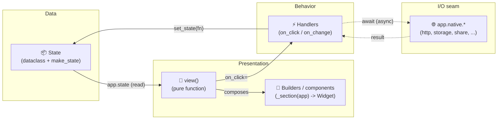
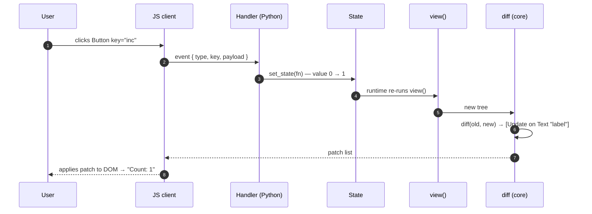

# App architecture & best practices

Just as `tempest-fastapi-sdk` enforces a strict
**router → controller → service → repository** slicing on the backend,
tempestweb enforces a strict flow on the frontend:

> **state → view → handlers → state**

A single unidirectional cycle. Every tempestweb app has the same shape, so a
developer dropped into a new app finds what they need on the first try — and the
same `view()` runs unchanged in **Mode A (WASM)** and **Mode B (server)**.

This page is your guide to **writing apps that don't rot into garbage code**. 🚀

!!! info "Prerequisites"
    Read the [Tutorial](tutorial/index.md) first — here we assume you already
    know what `view()`, `state` and `set_state` are. This page is about **how to
    organize** them once the app grows.

## The layers of an app



The cycle is **unidirectional**: the view only **reads** state, the handler only
**writes** state via `set_state`, and the reconciler redraws. Never cut across
the diagonal (a handler mutating the DOM, a view doing I/O) — that is where
garbage code is born.

## What lives where

!!! abstract "Responsibilities of each layer"

    | Layer | Responsible for | NEVER touches |
    | --- | --- | --- |
    | **State** (`dataclass` + `make_state`) | Pure session data, the initial value | Widgets, I/O, DOM |
    | **View** (`view(app)`) | Reading `app.state` and returning the widget tree | Mutating state, I/O, DOM, `await` |
    | **Builders / components** (`_section(app)`) | Breaking the view into named, reusable pieces | Mutating state directly, I/O |
    | **Handlers** (`on_click` / `on_change`) | State transitions via `set_state`; orchestrating `await app.native.*` | Mutating the DOM, reading/writing globals |
    | **Native** (`app.native.*`) | All I/O (HTTP, storage, share, geo, camera) — typed awaitables | Business rules, state |

The view is **pure** (like a side-effect-free function component). Handlers are
the **only** place that changes state. `app.native.*` is the **only** I/O seam —
and it has the same API in both modes, so your code doesn't know (nor needs to
know) whether the call is in-process (A) or a network round-trip (B).

## File layout

### Small app: one `app.py` in sections

For most gallery examples a single file is enough — **but with sections in cycle
order**, always the same:

```python
"""Counter — a single-concern example app.

Runs unchanged in both modes:

    tempestweb dev --mode wasm
    tempestweb dev --mode server
"""

from __future__ import annotations

from dataclasses import dataclass

from tempest_core import App, Button, Column, Row, Style, Text, Widget
from tempest_core.style import Edge


# --------------------------------------------------------------------------
# 1. State
# --------------------------------------------------------------------------
@dataclass
class CounterState:
    """State for the counter app."""

    value: int = 0


def make_state() -> CounterState:
    """Build the initial state.

    Returns:
        A fresh counter state landing on zero.
    """
    return CounterState()


# --------------------------------------------------------------------------
# 2. Section builders (private, _ prefixed)
# --------------------------------------------------------------------------
def _controls(app: App[CounterState]) -> Widget:
    """Render the +/- control row.

    Args:
        app: The application handle.

    Returns:
        A row with the decrement and increment buttons.
    """

    def increment() -> None:
        app.set_state(lambda s: setattr(s, "value", s.value + 1))

    def decrement() -> None:
        app.set_state(lambda s: setattr(s, "value", s.value - 1))

    return Row(
        style=Style(gap=4.0),
        children=[
            Button(label="-", on_click=decrement, key="dec"),
            Button(label="+", on_click=increment, key="inc"),
        ],
    )


# --------------------------------------------------------------------------
# 3. View (composition — no logic)
# --------------------------------------------------------------------------
def view(app: App[CounterState]) -> Widget:
    """Render the counter UI from the current state.

    Args:
        app: The application handle exposing ``state`` and ``set_state``.

    Returns:
        The widget tree for the current state.
    """
    return Column(
        style=Style(gap=8.0, padding=Edge.all(16)),
        children=[
            Text(content=f"Count: {app.state.value}", key="label"),
            _controls(app),
        ],
    )
```

The order is always **State → builders → `view`**. Whoever opens the file reads
top to bottom in the same sequence as the data cycle.

!!! tip "`make_state` is a factory, not a constant"
    In Mode B **each connection has its own isolated state**. `make_state()`
    returns a **new** instance per session — never a module-level singleton
    shared across clients. Use `field(default_factory=...)` for lists/dicts
    inside the dataclass for the same reason.

### Large app: split into modules

When `app.py` grows past ~300 lines (see `dashboard-shell`, `router-drawer`,
`theme-switcher` in the gallery), split it — keeping the same layers:

```text
my_app/
├── app.py            # only `make_state` + `view` (lean composition)
├── state.py          # the state dataclasses
├── components.py     # reusable builders: _stat_card(...), _alert(...)
└── views/
    ├── overview.py   # _overview_body(app) -> Widget
    └── settings.py   # _settings_body(app) -> Widget
```

!!! warning "Keep the single seam"
    tempestweb's structural rule: **only `transports/` separates the modes**. In
    your app the analog holds — only `app.native.*` separates "what is I/O".
    Don't write an `if mode == "server"` in your app: if you're checking the
    mode, you're breaking the "one `view()`, two modes" promise.

## Lifecycle of an interaction

Mirrors FastAPI's "request lifecycle" — but the transport is patches, not JSON:



Each step has a clear owner — the **handler never touches the DOM**, the **view
never mutates state**, the **diff comes from the core** (you never hand-write a
patch). Multiple `set_state` in the same tick **coalesce** into a single diff.

## Anti-patterns: how NOT to write garbage code

!!! danger "❌ Mutating the DOM inside a handler"
    ```python
    def on_click() -> None:
        document.getElementById("label").innerText = "1"  # ❌ NEVER
    ```
    You don't have (nor want) DOM access in Python. In Mode B there is no DOM on
    this side at all. **Change the state**; the reconciler figures out the patch.
    ```python
    def on_click() -> None:
        app.set_state(lambda s: setattr(s, "value", 1))  # ✅
    ```

!!! danger "❌ Mutating `app.state` directly"
    ```python
    app.state.value += 1            # ❌ no rebuild fires
    app.state.items.append(new)     # ❌ same
    ```
    Without `set_state`, the runtime doesn't know it must re-run `view()`. Always:
    ```python
    app.set_state(lambda s: setattr(s, "value", s.value + 1))   # ✅

    def add(s: State) -> None:                                  # ✅ compound mutation
        s.items.append(new)
    app.set_state(add)
    ```

!!! danger "❌ I/O or `await` inside `view()`"
    ```python
    def view(app: App[State]) -> Widget:
        data = requests.get("/api/x").json()   # ❌ blocks, and runs every rebuild
        return Text(content=data["name"])
    ```
    `view()` runs on **every** state change and must be synchronous, pure and
    cheap. I/O lives in an `async` handler that stores the result in state:
    ```python
    async def load() -> None:                                   # ✅
        data = await app.native.http.get_json("/api/x")
        app.set_state(lambda s: setattr(s, "name", data["name"]))
    ```

!!! warning "❌ A fat view with business logic baked in"
    A 300-line `view()` with total computation, filtering and formatting buried
    in the tree is unreadable. Extract: **derived data** into state (or a pure
    function), **tree pieces** into `_section(app)` builders. The final `view()`
    only **composes**.

!!! warning "❌ Forgetting `key` on dynamic items"
    Lists that insert/remove/reorder **need** a stable per-item `key` — otherwise
    reconciliation falls back to positional matching and you get wrong patches
    (input state leaking between rows). Use the data id, not the index:
    ```python
    children=[_row(item, key=f"row-{item.id}") for item in app.state.items]  # ✅
    ```

!!! tip "✅ Use the ready-made components before building from scratch"
    Don't build a login field by field — `tempestweb.components` ships
    `EmailField`, `PasswordField`, `LoginForm`, `SignupForm` and validators
    (`validate_email`, `validate_cpf`, ...). See
    [Ready-made components](components.md).

## Typing and style (inherited from CLAUDE.md)

The same quality bar as the backend applies here:

- **Type everything.** `view(app: App[State]) -> Widget`, handlers `-> None` (or
  `async def ... -> None`), builders `_section(app: App[State]) -> Widget`. mypy
  `--strict` is unforgiving.
- **Double quotes** everywhere.
- **Google-style docstrings in English** on every public function/class.
- **Empty collections = `[]`**, never `None`. Use `field(default_factory=list)`
  in the state dataclass.
- **Style is a typed object** (`Style`), not a CSS string. Declare intent; the
  client translates.

## Recap

- The flow is **state → view → handlers → state**, unidirectional.
- **State**: pure dataclass + `make_state()` factory (isolated per session).
- **View**: pure function, composes only; no mutation, no I/O, no `await`.
- **Handlers**: the only place that calls `set_state`; `async` for I/O via
  `app.native.*` — the only I/O seam.
- Small app = `app.py` in cycle-order sections; large app = split into
  `state.py` / `components.py` / `views/`, keeping the layers.
- Garbage code is born by cutting across the diagonal — DOM in a handler, I/O in
  the view, direct state mutation, a dynamic item without a `key`.

Now see the patterns in practice in the [Example gallery](examples/index.md). 🚀
