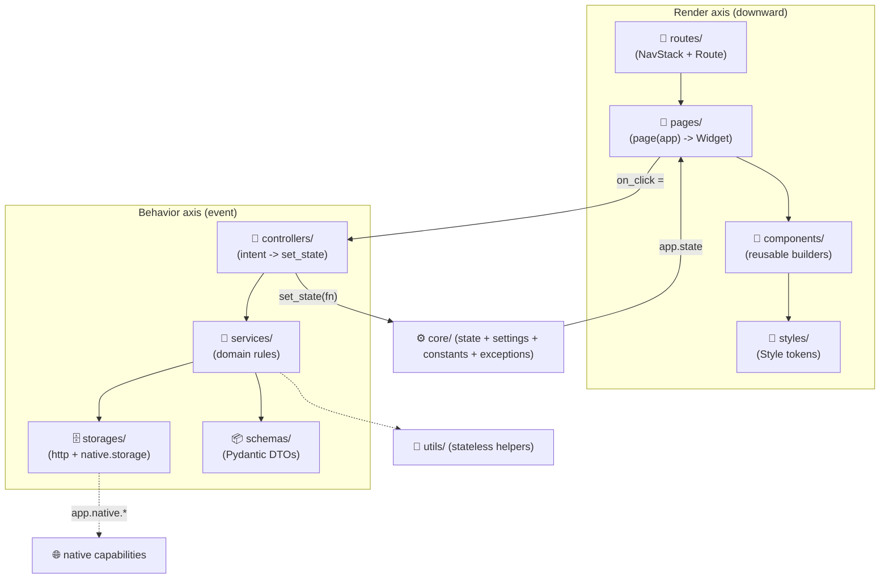

# App architecture & best practices

Just as `tempest-fastapi-sdk` enforces a strict
**router → controller → service → repository** slicing on the backend, a real
tempestweb app is organized into **layers with clear owners**. The runtime gives
you a cycle; the layers give you **where to put each thing** so the app doesn't
rot into garbage code. 🚀

!!! info "Prerequisites"
    Read the [Tutorial](tutorial/index.md) first — here we assume you already
    know `view()`, `state` and `set_state`. This page is about **how to
    structure** a real app on top of that cycle.

## Two truths: the cycle and the layers

**The cycle is the runtime contract** — immutable, holds in both modes:

> **state → view → handlers → state**

The view only **reads** state; handlers only **write** via `set_state`; the
reconciler redraws. **The layers** are how you **organize the code** that fills
that cycle as the app grows.



The **render axis** goes down: the route picks the page, the page composes
components, components use style tokens. The **behavior axis** fires on an event:
the page delegates to the controller, which orchestrates services, which talk to
storages and schemas — and finally the controller calls `set_state`, closing the
cycle.

## What lives where

!!! abstract "Responsibilities of each layer"

    | Layer | Folder | Responsible for | NEVER touches |
    | --- | --- | --- | --- |
    | **Routes** | `routes/` | Map route → page; `NavStack`/`Route`; navigation guards | Widgets, business rules |
    | **Pages** | `pages/` | One screen = `page(app) -> Widget`; compose components; wire event → controller | I/O, business rules, raw inline style |
    | **Components** | `components/` | **Reusable, presentational** widget builders (`card(...)`, controlled fields `value`+`on_change`) | State mutation, I/O, navigation |
    | **Styles** | `styles/` | Shared `Style` tokens — colors, spacing, typography, theme | Logic, widgets |
    | **Controllers** | `controllers/` | Turn user intent into `set_state`; orchestrate multiple services | Direct HTTP/storage, building widgets |
    | **Services** | `services/` | Domain rules; combine storages + native; return schemas | Raw HTTP/DOM, `set_state`, widgets |
    | **Storages** | `storages/` | Data access: backend HTTP client, `app.native.storage` (IndexedDB), cache | Business rules, widgets |
    | **Schemas** | `schemas/` | Pydantic v2 DTOs — API responses, forms, domain shapes | Logic, I/O |
    | **Utils** | `utils/` | Stateless helpers — formatters, validators, parsers | State, I/O, widgets |
    | **Core** | `core/` | `state` (dataclasses + `make_state`), `settings`, `constants`, `exceptions` | — |

The golden rule of the slicing (same as the backend): **don't skip layers**. A
page does **not** call a storage directly; it calls the controller, which calls
the service, which calls the storage. Every diagonal jump is technical debt.

## File layout

```text
my_app/
├── app.py                  # make_state + view: resolve route → page (lean)
├── core/
│   ├── settings.py         # typed config (BaseAppSettings)
│   ├── constants.py        # app constants
│   ├── exceptions.py       # domain exceptions
│   └── state.py            # state dataclasses + make_state
├── routes/
│   └── __init__.py         # route table + resolve(app) -> Widget
├── pages/
│   ├── login.py            # login_page(app) -> Widget
│   └── home.py
├── components/
│   ├── card.py             # card(...) -> Widget
│   └── fields.py           # reusable controlled fields
├── styles/
│   └── tokens.py           # COLORS, SPACING, Style presets
├── controllers/
│   └── auth.py             # AuthController.login(app, ...)
├── services/
│   └── auth.py             # AuthService.authenticate(...)
├── storages/
│   ├── http.py             # backend client (app.native.http)
│   └── prefs.py            # device storage (app.native.storage)
├── schemas/
│   └── user.py             # UserSchema(BaseModel)
└── utils/
    └── format.py
```

!!! tip "A small app doesn't need all of it"
    A single-concern example (counter, stopwatch) fits in one `app.py`. The
    layers **emerge as the app grows** — exactly like on the backend you omit
    `queue/` and `tasks/` when you don't use them. Start simple; promote to a
    folder when the file passes ~300 lines or the responsibility repeats.

## A flow crossing the layers (login)

Watch login descend through the layers — each file with a single responsibility.

### `schemas/user.py` — the shape of the data

```python
from pydantic import BaseModel


class UserSchema(BaseModel):
    """Authenticated user returned by the backend.

    Attributes:
        id: The user's unique identifier.
        name: The display name.
        token: The bearer token for subsequent calls.
    """

    id: str
    name: str
    token: str
```

### `storages/http.py` — data access (the only I/O seam)

```python
from tempest_core import App

from my_app.schemas import UserSchema


class AuthStorage:
    """Talks to the backend auth endpoints via the native HTTP capability."""

    async def login(self, app: App, email: str, password: str) -> UserSchema:
        """Authenticate against the backend.

        Args:
            app: The application handle (exposes ``native.http``).
            email: The user-supplied email.
            password: The user-supplied password.

        Returns:
            The authenticated user payload.

        Raises:
            HTTPError: If the backend rejects the credentials.
        """
        data = await app.native.http.post_json(
            "/api/auth/login", {"email": email, "password": password}
        )
        return UserSchema(**data)
```

### `services/auth.py` — domain rules

```python
from tempest_core import App

from my_app.schemas import UserSchema
from my_app.storages import AuthStorage


class AuthService:
    """Business rules around authentication."""

    def __init__(self, storage: AuthStorage) -> None:
        """Initialize the service.

        Args:
            storage: The data-access layer for auth.
        """
        self._storage = storage

    async def authenticate(self, app: App, email: str, password: str) -> UserSchema:
        """Validate input and authenticate the user.

        Args:
            app: The application handle.
            email: The user email.
            password: The user password.

        Returns:
            The authenticated user.

        Raises:
            ValueError: If email or password is empty.
        """
        if not email or not password:
            raise ValueError("Email and password are required.")
        return await self._storage.login(app, email, password)
```

### `controllers/auth.py` — intent → `set_state`

```python
from tempest_core import App, Route

from my_app.core.state import AppState
from my_app.services import AuthService


class AuthController:
    """Turns user intent into state transitions."""

    def __init__(self, service: AuthService) -> None:
        """Initialize the controller.

        Args:
            service: The auth domain service.
        """
        self._service = service

    async def login(self, app: App[AppState], email: str, password: str) -> None:
        """Handle a login attempt and update the state.

        Args:
            app: The application handle.
            email: The submitted email.
            password: The submitted password.
        """
        app.set_state(lambda s: setattr(s, "loading", True))
        try:
            user = await self._service.authenticate(app, email, password)
        except Exception as exc:  # noqa: BLE001 — map domain error to the UI

            def fail(s: AppState) -> None:
                s.loading = False
                s.error = str(exc)

            app.set_state(fail)
            return

        def done(s: AppState) -> None:
            s.loading = False
            s.user = user
            s.error = ""

        app.set_state(done)
        app.replace(Route(name="/home"))  # navigate only on success
```

### `pages/login.py` — composes components, wires the event

```python
from tempest_core import App, Column, Widget

from my_app.components import EmailField, PasswordField, PrimaryButton
from my_app.controllers import AuthController
from my_app.core.state import AppState
from my_app.styles import SCREEN


def login_page(app: App[AppState], controller: AuthController) -> Widget:
    """Render the login screen.

    Args:
        app: The application handle.
        controller: The auth controller wired by ``app.py``.

    Returns:
        The login screen widget tree.
    """

    def set_email(v: str) -> None:
        app.set_state(lambda s: setattr(s, "email", v))

    def set_password(v: str) -> None:
        app.set_state(lambda s: setattr(s, "password", v))

    async def submit() -> None:
        await controller.login(app, app.state.email, app.state.password)

    return Column(
        style=SCREEN,
        children=[
            EmailField(value=app.state.email, on_change=set_email, key="email"),
            PasswordField(value=app.state.password, on_change=set_password, key="pw"),
            PrimaryButton(label="Sign in", on_click=submit, key="submit"),
        ],
    )
```

### `styles/tokens.py` — style is a token, not an inline string

```python
from tempest_core import Style
from tempest_core.style import Color, Edge

PRIMARY: Color = Color(r=63, g=81, b=181, a=1.0)
SCREEN: Style = Style(gap=12.0, padding=Edge.all(24))
```

### `app.py` — the route picks the page, the wiring lives here

```python
from tempest_core import App, Route, Widget

from my_app.controllers import AuthController
from my_app.core.state import AppState, make_state
from my_app.pages import home_page, login_page
from my_app.services import AuthService
from my_app.storages import AuthStorage

_auth = AuthController(AuthService(AuthStorage()))  # composition root


def view(app: App[AppState]) -> Widget:
    """Resolve the current route to a page.

    Args:
        app: The application handle.

    Returns:
        The widget tree of the active route.
    """
    if app.nav.top.name == "/home":
        return home_page(app)
    return login_page(app, _auth)
```

!!! info "Where the wiring lives"
    The **`app.py` is the composition root** — the only place that builds
    controllers, services and storages and wires them together. The lower layers
    receive their dependencies through the constructor
    (`AuthController(AuthService(AuthStorage()))`), analogous to FastAPI's
    `dependencies/` + `Depends()`. Nothing down there instantiates what's below
    it inline.

## Anti-patterns: how NOT to write garbage code

!!! danger "❌ Skipping layers"
    A page calling HTTP directly, or a component reading `app.native.storage`:
    ```python
    async def login_page(app):
        data = await app.native.http.post_json(...)   # ❌ I/O in the page
    ```
    The page fires intent → **controller → service → storage**. Every skipped
    jump is debt.

!!! danger "❌ Mutating the DOM / mutating `app.state` directly"
    ```python
    app.state.value += 1                # ❌ no rebuild fires
    document.getElementById("x")...     # ❌ doesn't exist in Mode B
    ```
    Always `app.set_state(fn)`. The reconciler figures out the patch.

!!! danger "❌ I/O or `await` inside `view()`/`page()`"
    The view runs on **every** rebuild and must be synchronous and pure. I/O
    lives in the service (called by an `async` controller), and the result comes
    back in through `set_state`.

!!! warning "❌ Business logic in the page"
    Total computation, validation, flow decisions buried in the widget tree.
    That's a **service**. The page only composes and delegates.

!!! warning "❌ Loose inline style instead of a token"
    A repeated `Style(...)` scattered across pages becomes inconsistency.
    Centralize it in `styles/` and import the token. Style is a **typed** object,
    not a CSS string.

!!! warning "❌ `NotFoundError` for an empty collection / `list | None`"
    Empty collections return `[]`, never an exception; use
    `field(default_factory=list)` in state. 404/error is for single resources
    only. (Inherited from CLAUDE.md.)

!!! tip "✅ Use the ready-made components"
    `tempestweb.components` already ships `EmailField`, `PasswordField`,
    `LoginForm`, `SignupForm` and validators. See
    [Ready-made components](components.md).

## Typing and style (inherited from CLAUDE.md)

- **Type everything** — `view(app: App[State]) -> Widget`,
  handlers/controllers `async def ... -> None`, services returning schemas. mypy
  `--strict`.
- **Double quotes** everywhere; **Google-style docstrings in English**.
- **Re-export in each layer's `__init__.py`** (`from my_app.services import AuthService`),
  never import from a submodule directly.
- **Empty collections = `[]`**; `field(default_factory=list)` in state.

## Recap

- **The cycle** (`state → view → handlers → state`) is the runtime contract;
  **the layers** organize the code that fills it.
- Two axes: **render** (`routes → pages → components → styles`) and **behavior**
  (`controllers → services → storages/schemas`), closing on `set_state` over the
  state in `core/`.
- **Don't skip layers** — a page doesn't talk to a storage; it goes through
  controller → service.
- `app.py` is the **composition root** (does the wiring); everything else
  receives dependencies through the constructor.
- A small app fits in one file; the layers **emerge as it grows**.

Now see the patterns in practice in the [Example gallery](examples/index.md). 🚀
