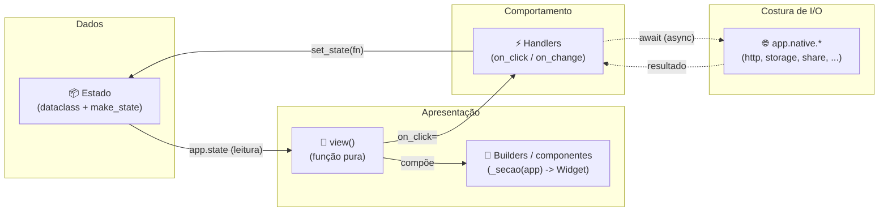
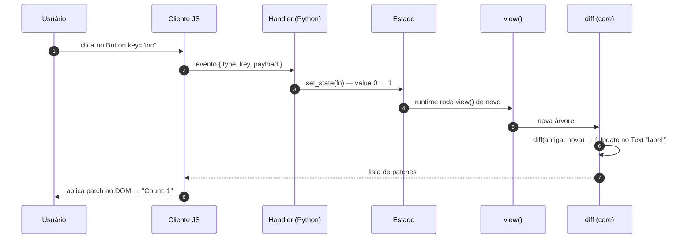

# Arquitetura de um app & boas práticas

Assim como o `tempest-fastapi-sdk` impõe um fatiamento estrito
**router → controller → service → repository** para o backend, o tempestweb
impõe um fluxo estrito para o frontend:

> **estado → view → handlers → estado**

Um único ciclo unidirecional. Todo app tempestweb tem o mesmo formato, então um
desenvolvedor jogado num app novo encontra o que procura logo de primeira — e o
mesmo `view()` roda inalterado no **Modo A (WASM)** e no **Modo B (servidor)**.

Esta página é o seu guia para **escrever apps que não viram código lixo**. 🚀

!!! info "Pré-requisitos"
    Leia o [Tutorial](tutorial/index.md) primeiro — aqui assumimos que você já
    sabe o que são `view()`, `state` e `set_state`. Esta página é sobre **como
    organizar** isso quando o app cresce.

## As camadas de um app



O ciclo é **unidirecional**: a view só **lê** o estado, o handler só **escreve**
no estado via `set_state`, e o reconciliador redesenha. Nunca atravesse na
diagonal (handler mutando DOM, view fazendo I/O) — é aí que nasce o código lixo.

## O que vive onde

!!! abstract "Responsabilidades de cada camada"

    | Camada | Responsável por | NUNCA toca |
    | --- | --- | --- |
    | **Estado** (`dataclass` + `make_state`) | Dados puros da sessão, valor inicial | Widgets, I/O, DOM |
    | **View** (`view(app)`) | Ler `app.state` e devolver a árvore de widgets | Mutar estado, I/O, DOM, `await` |
    | **Builders / componentes** (`_secao(app)`) | Quebrar a view em pedaços nomeados e reusáveis | Mutar estado direto, I/O |
    | **Handlers** (`on_click` / `on_change`) | Transições de estado via `set_state`; orquestrar `await app.native.*` | Mutar o DOM, ler/escrever globais |
    | **Native** (`app.native.*`) | Toda E/S (HTTP, storage, share, geo, câmera) — awaitables tipados | Regras de negócio, estado |

A view é **pura** (igual a um componente de função sem efeitos colaterais). Os
handlers são o **único** lugar que muda estado. `app.native.*` é a **única**
costura de I/O — e tem a mesma API nos dois modos, então seu código não sabe (nem
precisa saber) se a chamada é em-processo (A) ou um round-trip de rede (B).

## Layout de arquivo

### App pequeno: um `app.py` em seções

Para a maioria dos exemplos da galeria, um arquivo basta — **mas com seções na
ordem do ciclo**, sempre a mesma:

```python
"""Stopwatch — um app de exemplo de concern único.

Roda inalterado nos dois modos:

    tempestweb dev --mode wasm
    tempestweb dev --mode server
"""

from __future__ import annotations

from dataclasses import dataclass

from tempest_core import App, Button, Column, Row, Style, Text, Widget
from tempest_core.style import Edge


# --------------------------------------------------------------------------
# 1. Estado
# --------------------------------------------------------------------------
@dataclass
class CounterState:
    """State for the counter app."""

    value: int = 0


def make_state() -> CounterState:
    """Build the initial state.

    Returns:
        A fresh counter state landing on zero.
    """
    return CounterState()


# --------------------------------------------------------------------------
# 2. Builders de seção (privados, prefixados com _)
# --------------------------------------------------------------------------
def _controls(app: App[CounterState]) -> Widget:
    """Render the +/- control row.

    Args:
        app: The application handle.

    Returns:
        A row with the decrement and increment buttons.
    """

    def increment() -> None:
        app.set_state(lambda s: setattr(s, "value", s.value + 1))

    def decrement() -> None:
        app.set_state(lambda s: setattr(s, "value", s.value - 1))

    return Row(
        style=Style(gap=4.0),
        children=[
            Button(label="-", on_click=decrement, key="dec"),
            Button(label="+", on_click=increment, key="inc"),
        ],
    )


# --------------------------------------------------------------------------
# 3. View (composição — sem lógica)
# --------------------------------------------------------------------------
def view(app: App[CounterState]) -> Widget:
    """Render the counter UI from the current state.

    Args:
        app: The application handle exposing ``state`` and ``set_state``.

    Returns:
        The widget tree for the current state.
    """
    return Column(
        style=Style(gap=8.0, padding=Edge.all(16)),
        children=[
            Text(content=f"Count: {app.state.value}", key="label"),
            _controls(app),
        ],
    )
```

A ordem é sempre **Estado → builders → `view`**. Quem abre o arquivo lê de cima
pra baixo na mesma sequência do ciclo de dados.

!!! tip "`make_state` é uma fábrica, não uma constante"
    No Modo B **cada conexão tem seu próprio estado isolado**. `make_state()`
    devolve uma instância **nova** por sessão — nunca um singleton de nível de
    módulo compartilhado entre clientes. Use `field(default_factory=...)` para
    listas/dicts dentro do dataclass pelo mesmo motivo.

### App grande: quebre em módulos

Quando o `app.py` passa de ~300 linhas (veja `dashboard-shell`, `router-drawer`,
`theme-switcher` na galeria), separe — mas mantendo as mesmas camadas:

```text
meu_app/
├── app.py            # só `make_state` + `view` (composição enxuta)
├── state.py          # os dataclasses de estado
├── components.py     # builders reusáveis: _stat_card(...), _alert(...)
└── views/
    ├── overview.py   # _overview_body(app) -> Widget
    └── settings.py   # _settings_body(app) -> Widget
```

!!! warning "Mantenha a costura única"
    A regra estrutural do tempestweb: **só `transports/` separa os modos**. No
    seu app vale o análogo — só `app.native.*` separa "o que é I/O". Não crie um
    `if mode == "server"` no seu app: se você está checando o modo, está
    quebrando a promessa de "um `view()`, dois modos".

## Ciclo de uma interação

Espelha o "ciclo de vida da requisição" do FastAPI — mas o transporte é patches,
não JSON:



Cada passo tem um dono claro — o **handler nunca toca no DOM**, a **view nunca
muta o estado**, o **diff é do core** (você não escreve patch à mão). Múltiplos
`set_state` no mesmo tick **coalescem** num só diff.

## Anti-padrões: como NÃO escrever código lixo

!!! danger "❌ Mutar o DOM dentro de um handler"
    ```python
    def on_click() -> None:
        document.getElementById("label").innerText = "1"  # ❌ NUNCA
    ```
    Você não tem (nem quer) acesso ao DOM no Python. No Modo B nem existe DOM do
    lado de cá. **Mude o estado**; o reconciliador descobre o patch.
    ```python
    def on_click() -> None:
        app.set_state(lambda s: setattr(s, "value", 1))  # ✅
    ```

!!! danger "❌ Mutar `app.state` direto"
    ```python
    app.state.value += 1            # ❌ não dispara rebuild
    app.state.items.append(novo)    # ❌ idem
    ```
    Sem `set_state`, o runtime não sabe que precisa rerodar a `view()`. Sempre:
    ```python
    app.set_state(lambda s: setattr(s, "value", s.value + 1))   # ✅

    def add(s: State) -> None:                                  # ✅ mutação composta
        s.items.append(novo)
    app.set_state(add)
    ```

!!! danger "❌ I/O ou `await` dentro da `view()`"
    ```python
    def view(app: App[State]) -> Widget:
        data = requests.get("/api/x").json()   # ❌ bloqueia, e roda a cada rebuild
        return Text(content=data["name"])
    ```
    A `view()` roda a **cada** mudança de estado e tem que ser síncrona, pura e
    barata. I/O vive num handler `async`, que guarda o resultado no estado:
    ```python
    async def load() -> None:                                   # ✅
        data = await app.native.http.get_json("/api/x")
        app.set_state(lambda s: setattr(s, "name", data["name"]))
    ```

!!! warning "❌ View gorda com lógica de negócio embutida"
    Uma `view()` de 300 linhas com cálculo de total, filtro e formatação no meio
    da árvore é ilegível. Extraia: **dados derivados** no estado (ou numa função
    pura), **pedaços de árvore** em builders `_secao(app)`. A `view()` final só
    **compõe**.

!!! warning "❌ Esquecer `key` em itens dinâmicos"
    Listas que inserem/removem/reordenam **precisam** de `key` estável por item —
    senão a reconciliação cai no casamento posicional e você vê patches errados
    (estado de input vazando entre linhas). Use o id do dado, não o índice:
    ```python
    children=[_row(item, key=f"row-{item.id}") for item in app.state.items]  # ✅
    ```

!!! tip "✅ Use os componentes prontos antes de montar do zero"
    Não monte um login campo a campo — `tempestweb.components` traz
    `EmailField`, `PasswordField`, `LoginForm`, `SignupForm` e validadores
    (`validate_email`, `validate_cpf`, ...). Veja
    [Componentes prontos](components.md).

## Tipagem e estilo (herdam do CLAUDE.md)

O mesmo padrão de qualidade do backend vale aqui:

- **Tipe tudo.** `view(app: App[State]) -> Widget`, handlers `-> None` (ou
  `async def ... -> None`), builders `_secao(app: App[State]) -> Widget`. mypy
  `--strict` não perdoa.
- **Aspas duplas** em todo lugar.
- **Docstrings Google em inglês** em toda função/classe pública.
- **Coleções vazias = `[]`**, nunca `None`. Use `field(default_factory=list)` no
  dataclass de estado.
- **Estilo é um objeto tipado** (`Style`), não string CSS. Declare a intenção; o
  cliente traduz.

## Recap

- O fluxo é **estado → view → handlers → estado**, unidirecional.
- **Estado**: dataclass puro + `make_state()` fábrica (isolada por sessão).
- **View**: função pura, só compõe; sem mutação, sem I/O, sem `await`.
- **Handlers**: o único lugar que chama `set_state`; `async` para I/O via
  `app.native.*` — a única costura de E/S.
- App pequeno = `app.py` em seções na ordem do ciclo; app grande = quebre em
  `state.py` / `components.py` / `views/`, mantendo as camadas.
- Código lixo nasce ao atravessar na diagonal — DOM no handler, I/O na view,
  mutação direta do estado, item dinâmico sem `key`.

Agora veja os padrões na prática na [Galeria de exemplos](examples/index.md). 🚀
