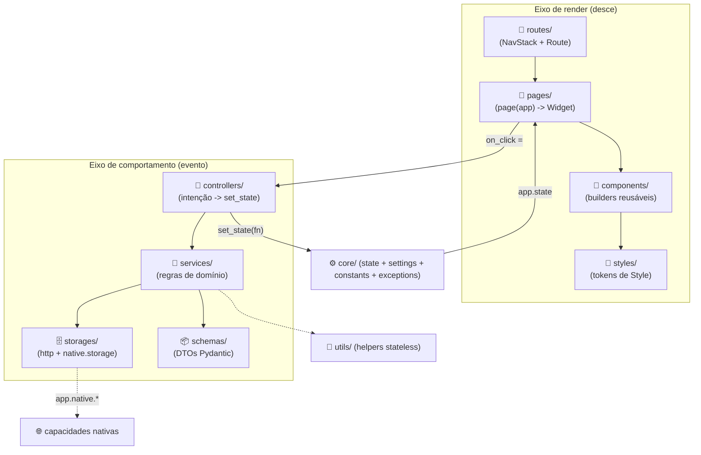

# Arquitetura de um app & boas práticas

Assim como o `tempest-fastapi-sdk` impõe um fatiamento estrito
**router → controller → service → repository** no backend, um app tempestweb de
verdade se organiza em **camadas com donos claros**. O runtime te dá um ciclo;
as camadas te dão **onde colocar cada coisa** para o app não virar código lixo. 🚀

!!! info "Pré-requisitos"
    Leia o [Tutorial](tutorial/index.md) primeiro — aqui assumimos que você já
    conhece `view()`, `state` e `set_state`. Esta página é sobre **como
    estruturar** um app real em cima desse ciclo.

## Duas verdades: o ciclo e as camadas

**O ciclo é o contrato do runtime** — imutável, vale nos dois modos:

> **estado → view → handlers → estado**

A view só **lê** o estado; os handlers só **escrevem** via `set_state`; o
reconciliador redesenha. **As camadas** são como você **organiza o código** que
preenche esse ciclo quando o app cresce.



O **eixo de render** desce: a rota escolhe a página, a página compõe componentes,
os componentes usam tokens de estilo. O **eixo de comportamento** dispara num
evento: a página delega ao controller, que orquestra services, que falam com
storages e schemas — e no fim o controller chama `set_state`, fechando o ciclo.

## O que vive onde

!!! abstract "Responsabilidades de cada camada"

    | Camada | Pasta | Responsável por | NUNCA toca |
    | --- | --- | --- | --- |
    | **Routes** | `routes/` | Mapear rota → página; `NavStack`/`Route`; guardas de navegação | Widgets, regras de negócio |
    | **Pages** | `pages/` | Uma tela = `page(app) -> Widget`; compor componentes; ligar evento → controller | I/O, regras de negócio, estilo inline cru |
    | **Components** | `components/` | Builders de widget **reusáveis e apresentacionais** (`card(...)`, campos controlados `value`+`on_change`) | Mutar estado, I/O, navegação |
    | **Styles** | `styles/` | Tokens de `Style` compartilhados — cores, espaçamento, tipografia, tema | Lógica, widgets |
    | **Controllers** | `controllers/` | Traduzir intenção do usuário em `set_state`; orquestrar múltiplos services | HTTP/storage direto, construir widgets |
    | **Services** | `services/` | Regras de domínio; combinar storages + native; devolver schemas | HTTP/DOM cru, `set_state`, widgets |
    | **Storages** | `storages/` | Acesso a dados: cliente HTTP do backend, `app.native.storage` (IndexedDB), cache | Regras de negócio, widgets |
    | **Schemas** | `schemas/` | DTOs Pydantic v2 — respostas de API, formulários, formas de domínio | Lógica, I/O |
    | **Utils** | `utils/` | Helpers stateless — formatadores, validadores, parsers | Estado, I/O, widgets |
    | **Core** | `core/` | `state` (dataclasses + `make_state`), `settings`, `constants`, `exceptions` | — |

A regra de ouro do fatiamento (igual ao backend): **não pule camadas**. Uma
página **não** chama um storage direto; ela chama o controller, que chama o
service, que chama o storage. Cada salto na diagonal é dívida técnica.

## Layout de arquivo

```text
my_app/
├── app.py                  # make_state + view: resolve a rota → page (enxuto)
├── core/
│   ├── settings.py         # config tipada (BaseAppSettings)
│   ├── constants.py        # constantes do app
│   ├── exceptions.py       # exceções de domínio
│   └── state.py            # dataclasses de estado + make_state
├── routes/
│   └── __init__.py         # tabela de rotas + resolve(app) -> Widget
├── pages/
│   ├── login.py            # login_page(app) -> Widget
│   └── home.py
├── components/
│   ├── card.py             # card(...) -> Widget
│   └── fields.py           # campos controlados reusáveis
├── styles/
│   └── tokens.py           # COLORS, SPACING, presets de Style
├── controllers/
│   └── auth.py             # AuthController.login(app, ...)
├── services/
│   └── auth.py             # AuthService.authenticate(...)
├── storages/
│   ├── http.py             # cliente do backend (app.native.http)
│   └── prefs.py            # storage do dispositivo (app.native.storage)
├── schemas/
│   └── user.py             # UserSchema(BaseModel)
└── utils/
    └── format.py
```

!!! tip "App pequeno não precisa de tudo"
    Um exemplo de concern único (counter, stopwatch) cabe num `app.py` só. As
    camadas **emergem conforme o app cresce** — exatamente como no backend você
    omite `queue/` e `tasks/` quando não usa. Comece simples; promova para uma
    pasta quando o arquivo passar de ~300 linhas ou a responsabilidade se repetir.

## Um fluxo atravessando as camadas (login)

Veja o login descer pelas camadas — cada arquivo com uma responsabilidade só.

### `schemas/user.py` — a forma do dado

```python
from pydantic import BaseModel


class UserSchema(BaseModel):
    """Authenticated user returned by the backend.

    Attributes:
        id: The user's unique identifier.
        name: The display name.
        token: The bearer token for subsequent calls.
    """

    id: str
    name: str
    token: str
```

### `storages/http.py` — acesso a dados (a única costura de I/O)

```python
from tempest_core import App

from my_app.schemas import UserSchema


class AuthStorage:
    """Talks to the backend auth endpoints via the native HTTP capability."""

    async def login(self, app: App, email: str, password: str) -> UserSchema:
        """Authenticate against the backend.

        Args:
            app: The application handle (exposes ``native.http``).
            email: The user-supplied email.
            password: The user-supplied password.

        Returns:
            The authenticated user payload.

        Raises:
            HTTPError: If the backend rejects the credentials.
        """
        data = await app.native.http.post_json(
            "/api/auth/login", {"email": email, "password": password}
        )
        return UserSchema(**data)
```

### `services/auth.py` — regras de domínio

```python
from tempest_core import App

from my_app.schemas import UserSchema
from my_app.storages import AuthStorage


class AuthService:
    """Business rules around authentication."""

    def __init__(self, storage: AuthStorage) -> None:
        """Initialize the service.

        Args:
            storage: The data-access layer for auth.
        """
        self._storage = storage

    async def authenticate(self, app: App, email: str, password: str) -> UserSchema:
        """Validate input and authenticate the user.

        Args:
            app: The application handle.
            email: The user email.
            password: The user password.

        Returns:
            The authenticated user.

        Raises:
            ValueError: If email or password is empty.
        """
        if not email or not password:
            raise ValueError("Email and password are required.")
        return await self._storage.login(app, email, password)
```

### `controllers/auth.py` — intenção → `set_state`

```python
from tempest_core import App, Route

from my_app.core.state import AppState
from my_app.services import AuthService


class AuthController:
    """Turns user intent into state transitions."""

    def __init__(self, service: AuthService) -> None:
        """Initialize the controller.

        Args:
            service: The auth domain service.
        """
        self._service = service

    async def login(self, app: App[AppState], email: str, password: str) -> None:
        """Handle a login attempt and update the state.

        Args:
            app: The application handle.
            email: The submitted email.
            password: The submitted password.
        """
        app.set_state(lambda s: setattr(s, "loading", True))
        try:
            user = await self._service.authenticate(app, email, password)
        except Exception as exc:  # noqa: BLE001 — mapeia erro de domínio p/ UI

            def fail(s: AppState) -> None:
                s.loading = False
                s.error = str(exc)

            app.set_state(fail)
            return

        def done(s: AppState) -> None:
            s.loading = False
            s.user = user
            s.error = ""

        app.set_state(done)
        app.replace(Route(name="/home"))  # navega só após sucesso
```

### `pages/login.py` — compõe componentes, liga o evento

```python
from tempest_core import App, Column, Widget

from my_app.components import EmailField, PasswordField, PrimaryButton
from my_app.controllers import AuthController
from my_app.core.state import AppState
from my_app.styles import SCREEN


def login_page(app: App[AppState], controller: AuthController) -> Widget:
    """Render the login screen.

    Args:
        app: The application handle.
        controller: The auth controller wired by ``app.py``.

    Returns:
        The login screen widget tree.
    """

    def set_email(v: str) -> None:
        app.set_state(lambda s: setattr(s, "email", v))

    def set_password(v: str) -> None:
        app.set_state(lambda s: setattr(s, "password", v))

    async def submit() -> None:
        await controller.login(app, app.state.email, app.state.password)

    return Column(
        style=SCREEN,
        children=[
            EmailField(value=app.state.email, on_change=set_email, key="email"),
            PasswordField(value=app.state.password, on_change=set_password, key="pw"),
            PrimaryButton(label="Entrar", on_click=submit, key="submit"),
        ],
    )
```

### `styles/tokens.py` — estilo é token, não string inline

```python
from tempest_core import Style
from tempest_core.style import Color, Edge

PRIMARY: Color = Color(r=63, g=81, b=181, a=1.0)
SCREEN: Style = Style(gap=12.0, padding=Edge.all(24))
```

### `app.py` — a rota escolhe a página, o wiring vive aqui

```python
from tempest_core import App, Route, Widget

from my_app.controllers import AuthController
from my_app.core.state import AppState, make_state
from my_app.pages import home_page, login_page
from my_app.services import AuthService
from my_app.storages import AuthStorage

_auth = AuthController(AuthService(AuthStorage()))  # composição raiz


def view(app: App[AppState]) -> Widget:
    """Resolve the current route to a page.

    Args:
        app: The application handle.

    Returns:
        The widget tree of the active route.
    """
    if app.nav.top.name == "/home":
        return home_page(app)
    return login_page(app, _auth)
```

!!! info "Onde o wiring vive"
    O **`app.py` é a composição raiz** — o único lugar que constrói controllers,
    services e storages e os costura. As camadas de baixo recebem suas
    dependências pelo construtor (`AuthController(AuthService(AuthStorage()))`),
    análogo ao `dependencies/` + `Depends()` do FastAPI. Nada lá embaixo
    instancia o que está abaixo dele inline.

## Anti-padrões: como NÃO escrever código lixo

!!! danger "❌ Pular camadas"
    Página chamando HTTP direto, ou componente lendo `app.native.storage`:
    ```python
    async def login_page(app):
        data = await app.native.http.post_json(...)   # ❌ I/O na página
    ```
    A página dispara intenção → **controller → service → storage**. Cada salto
    pulado é dívida.

!!! danger "❌ Mutar o DOM / mutar `app.state` direto"
    ```python
    app.state.value += 1                # ❌ não dispara rebuild
    document.getElementById("x")...     # ❌ não existe no Modo B
    ```
    Sempre `app.set_state(fn)`. O reconciliador descobre o patch.

!!! danger "❌ I/O ou `await` dentro da `view()`/`page()`"
    A view roda a **cada** rebuild e é síncrona e pura. I/O vive no service
    (chamado por um controller `async`), e o resultado entra por `set_state`.

!!! warning "❌ Regra de negócio na página"
    Cálculo de total, validação, decisão de fluxo no meio da árvore de widgets.
    Isso é **service**. A página só compõe e delega.

!!! warning "❌ Estilo inline solto em vez de token"
    `Style(...)` repetido espalhado pelas páginas vira inconsistência. Centralize
    em `styles/` e importe o token. Estilo é objeto **tipado**, não string CSS.

!!! warning "❌ `NotFoundError` para coleção vazia / `list | None`"
    Coleções vazias retornam `[]`, nunca exceção; use `field(default_factory=list)`
    no estado. 404/erro só para recurso único. (Herda do CLAUDE.md.)

!!! tip "✅ Use os componentes prontos"
    `tempestweb.components` já traz `EmailField`, `PasswordField`, `LoginForm`,
    `SignupForm` e validadores. Veja [Componentes prontos](components.md).

## Tipagem e estilo (herdam do CLAUDE.md)

- **Tipe tudo** — `view(app: App[State]) -> Widget`, handlers/controllers
  `async def ... -> None`, services devolvendo schemas. mypy `--strict`.
- **Aspas duplas** em tudo; **docstrings Google em inglês**.
- **Re-exporte em `__init__.py`** de cada camada (`from my_app.services import AuthService`),
  nunca importe de submódulo direto.
- **Coleções vazias = `[]`**; `field(default_factory=list)` no estado.

## Recap

- **O ciclo** (`estado → view → handlers → estado`) é o contrato do runtime; **as
  camadas** organizam o código que o preenche.
- Dois eixos: **render** (`routes → pages → components → styles`) e
  **comportamento** (`controllers → services → storages/schemas`), fechando em
  `set_state` sobre o estado em `core/`.
- **Não pule camadas** — página não fala com storage; vai via controller →
  service.
- `app.py` é a **composição raiz** (faz o wiring); o resto recebe dependências
  pelo construtor.
- App pequeno cabe num arquivo; as camadas **emergem conforme cresce**.

Agora veja os padrões na prática na [Galeria de exemplos](examples/index.md). 🚀
