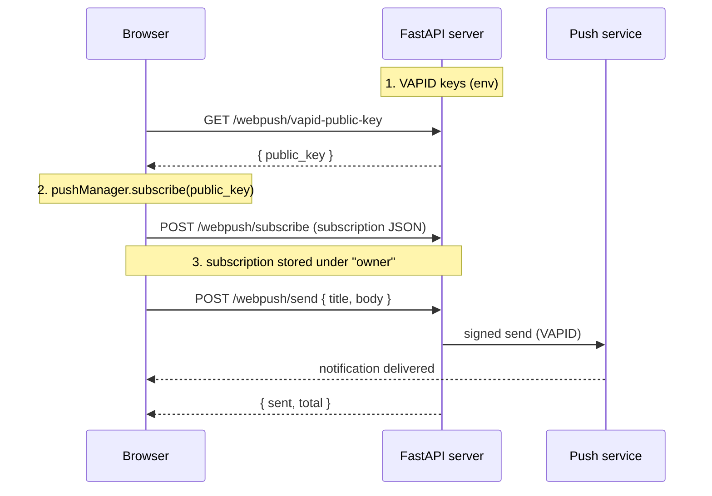

# WebPush end-to-end — from the server to the browser 🔔

The [PWA install + WebPush](pwa-webpush.md) example covered the **browser** side:
asking for permission and creating the push subscription. But a subscription
alone does nothing — someone has to actually **send** the notification. That
someone is **your server**, holding a **VAPID** key that proves to the browser's
push service that the send is legitimate.

This page closes the loop: you generate the keys, mount a ready-made FastAPI
router, the browser subscribes against your public key, and the server fires the
notification. All with the pieces in `tempestweb.server`.

---

## What you'll build

A minimal FastAPI app that:

1. **Generates** a VAPID keypair (once) and reads it from the environment.
2. **Mounts** the `webpush_router` — it already exposes the subscribe/send endpoints.
3. **Subscribes** the browser against the public key and stores the subscription.
4. **Sends** a notification to every stored subscription.



!!! info "Who does what"
    The **server** owns the VAPID keys, the subscription store and the send path.
    The **browser** owns the subscribe flow (service worker + `PushManager`). The
    push service (Google, Mozilla, Apple…) is the intermediary that actually
    delivers the message to the device.

---

## Prerequisites

Server-side WebPush needs the `[webpush]` extra (it brings `cryptography` for the
keys and `pywebpush` for sending):

```bash
pip install "tempestweb[webpush]"
```

---

## Step 1 — Generate the VAPID keys 🔑

VAPID (*Voluntary Application Server Identification*) is a P-256 keypair. The
**public** key goes to the browser; the **private** key signs every send and
stays on the server. Generate a pair with the CLI:

```bash
tempestweb vapid
```

```
public_key:  BEl62iUYgUiv...kr3qBUYIHBQFLXYp5Nksh8U
private_key: 3Kw...redacted...s0

Keep the private key secret (export as VAPID_PRIVATE_KEY); share the public key with the browser client.
```

To get lines ready to export as environment variables, use `--env`:

```bash
tempestweb vapid --env
```

```
VAPID_PUBLIC_KEY=BEl62iUYgUiv...kr3qBUYIHBQFLXYp5Nksh8U
VAPID_PRIVATE_KEY=3Kw...redacted...s0
```

You can load them straight into your shell:

```bash
eval "$(tempestweb vapid --env)"
```

!!! warning "The private key is a secret ⚠️"
    Never commit the private key. Treat it like any credential: pass it through an
    environment variable (`VAPID_PRIVATE_KEY`), a secret manager or a `.env` kept
    out of version control. Anyone holding that key can send push on your app's
    behalf.

??? note "Generating the keys in code"
    The CLI is a shortcut over `generate_vapid_keys()`. You can call it directly —
    for example, in a setup script:

    ```python
    from tempestweb.server import generate_vapid_keys

    keys = generate_vapid_keys()
    print(keys.public_key)   # base64url, unpadded
    print(keys.private_key)  # base64url, unpadded — keep it secret
    ```

    `VapidKeys` has just two fields: `.public_key` and `.private_key`.

---

## Step 2 — Mount the `webpush_router` 🚏

`webpush_router(service)` returns a ready `APIRouter`. Include it on your FastAPI
app and you get four JSON endpoints for free:

| Method | Route | Body | Response |
|---|---|---|---|
| `GET` | `/webpush/vapid-public-key` | — | `{"public_key": ...}` |
| `POST` | `/webpush/subscribe` | the browser subscription | `{"ok": true}` |
| `POST` | `/webpush/unsubscribe` | `{"endpoint": ...}` | `{"removed": true}` |
| `POST` | `/webpush/send` | payload (`{"title","body"}`) | `{"sent": N, "total": M}` |

Here's the complete app — copy and run it:

```python
from __future__ import annotations

from fastapi import FastAPI

from tempestweb.server import (
    InMemorySubscriptionStore,
    VapidConfig,
    WebPushService,
    generate_vapid_keys,
    webpush_router,
)


def _vapid() -> VapidConfig:
    """Resolve the VAPID config from the env, or an ephemeral dev keypair."""
    config = VapidConfig.from_env()  # reads VAPID_PUBLIC_KEY / _PRIVATE_KEY / _SUBJECT
    if config.enabled:
        return config
    keys = generate_vapid_keys()
    return VapidConfig(public_key=keys.public_key, private_key=keys.private_key)


VAPID = _vapid()
SERVICE = WebPushService(VAPID, store=InMemorySubscriptionStore())

app = FastAPI(title="my app with webpush")
app.include_router(webpush_router(SERVICE))
```

Piece by piece:

- `VapidConfig.from_env()` reads `VAPID_PUBLIC_KEY`, `VAPID_PRIVATE_KEY` and
  `VAPID_SUBJECT` from the environment. If you exported the keys in Step 1, this is
  where they land.
- `WebPushService(vapid, store=...)` ties the VAPID config to a subscription
  store. `InMemorySubscriptionStore` covers dev and tests; in production you supply
  your own (SQLAlchemy, Redis…) implementing the `SubscriptionStore` protocol.
- `webpush_router(SERVICE)` builds the router and `include_router` plugs it into
  the app.

!!! tip "An empty private key disables sending 💡"
    If `VAPID_PRIVATE_KEY` is empty, `VapidConfig.enabled` is `False` and every
    `send` becomes a no-op that reports `ok=False` (no network dependency is
    touched). It's the same "empty secret disables auth" pattern as the rest of the
    framework — great for running in dev with zero config. In the app above we
    generate an **ephemeral** pair in that case, so subscriptions simply reset on
    each restart.

!!! info "A single `owner` keeps the router simple"
    The router files every subscription under one `owner` (default `"default"`),
    so it's multi-tenant-free by design. An app with real users writes its own
    routes around the **same** `WebPushService`, resolving the `owner` from auth.
    The building blocks are reusable; only the "who owns this subscription" policy
    changes.

---

## Step 3 — The browser subscribes and sends the subscription 📮

In the browser the flow is: register a service worker, ask for permission, fetch
the server's public key, call `pushManager.subscribe(...)` and `POST` the
resulting subscription to `/webpush/subscribe`.

```javascript
const reg = await navigator.serviceWorker.register("/sw.js", { type: "classic" });
await navigator.serviceWorker.ready;

const perm = await Notification.requestPermission();
if (perm !== "granted") throw new Error("permission: " + perm);

// 1. get the server's public key
const { public_key } = await (await fetch("/webpush/vapid-public-key")).json();

// 2. subscribe against it (b64ToU8 turns the base64url key into a Uint8Array)
const sub = await reg.pushManager.subscribe({
  userVisibleOnly: true,
  applicationServerKey: b64ToU8(public_key),
});

// 3. send the subscription for the server to store
await fetch("/webpush/subscribe", {
  method: "POST",
  headers: { "content-type": "application/json" },
  body: JSON.stringify(sub.toJSON()),
});
```

!!! tip "On the Python side, use the native module"
    In a tempestweb app you don't write this JS by hand. The
    [transpile guide](../transpile.md) shows
    `native.notifications.subscribe(vapid_public_key)` — it returns exactly the
    subscription JSON you `POST` to `/webpush/subscribe` — and
    `native.notifications.push_state()`, which reports `{supported, permission}`
    without triggering the prompt. The JS block above is what runs underneath.

---

## Step 4 — The server fires the notification 🚀

With at least one subscription stored, a `POST` to `/webpush/send` pushes the
payload to **every** subscription of the `owner`:

```bash
curl -X POST http://127.0.0.1:8000/webpush/send \
  -H "content-type: application/json" \
  -d '{"title": "Hello", "body": "from tempestweb"}'
```

```json
{"sent": 1, "total": 1}
```

`sent` is how many the push service accepted; `total` is how many subscriptions
the `owner` had. Dead endpoints (the push service replies `410 Gone`) are pruned
from the store automatically on send.

??? note "Sending from inside your own code"
    The router is a thin shell over `WebPushService`. From anywhere in your app —
    a background task, an event handler — you call the service directly:

    ```python
    outcomes = SERVICE.send_to_owner("default", {"title": "Hello", "body": "world"})
    for outcome in outcomes:
        print(outcome.endpoint, outcome.ok, outcome.status_code)
    ```

    `send_to_owner` returns a list of `SendOutcome` (one per subscription, `[]`
    when the owner has none). There's also `broadcast(payload)` to reach **every**
    stored subscription, and `send(subscription, payload)` for a single one.

---

## The full example, running ▶

A ready-made app lives at `examples/webpush-server/server.py`: it resolves VAPID
from the environment (falling back to an ephemeral dev keypair), mounts the
`webpush_router` and serves a demo page with a minimal push service worker.

```bash
# optional: pin a keypair so subscriptions survive restarts
eval "$(tempestweb vapid --env)"

uv run uvicorn server:app --app-dir examples/webpush-server --reload
```

Open <http://127.0.0.1:8000>, click **Enable notifications** (grant permission),
then **Send test** — a system notification appears, delivered by the browser's
push service from the server's signed send.

!!! warning "Real delivery needs HTTPS + permission + (on iOS) the app installed"
    Real push delivery does **not** work in every context:

    - The page must be served over **HTTPS** (or `localhost` in dev).
    - The user must have **granted** notification permission.
    - On **iOS (16.4+)**, WebPush **only works with the PWA installed** to the home
      screen — see the [PWA install example](pwa-webpush.md) to generate the
      installable manifest.

---

## What's automatable — and what isn't ✅

Be honest about what the tests cover:

- ✅ **The server path is unit-tested.** Key generation, the router
  (subscribe/unsubscribe/send) and the `WebPushService` (with an injected sender)
  all have green tests — no network touched.
- ⚠️ **The browser subscribe/permission + real push delivery** are device-,
  gesture- and external-service-dependent. That is **not automatable in CI** and
  needs manual verification in a real browser.

!!! danger "No false promises"
    This example does **not** claim automated end-to-end delivery. The server signs
    and dispatches the request; from there, the push service and the device decide
    whether and when the notification appears.

---

## Recap

In this guide you:

- ✅ Generated a VAPID keypair with `tempestweb vapid --env` (and saw
  `generate_vapid_keys()` underneath).
- ✅ Mounted the `webpush_router` on a FastAPI app with `app.include_router(...)`.
- ✅ Learned the four endpoints: `vapid-public-key`, `subscribe`, `unsubscribe`
  and `send`.
- ✅ Subscribed the browser against the public key and sent the subscription for
  the server to store.
- ✅ Fired a notification with `POST /webpush/send` (and saw `send_to_owner` /
  `broadcast` on the service).
- ✅ Understood that the private key is a secret, that an empty key disables
  sending, and that real delivery needs HTTPS + permission + (iOS) the app
  installed.

---

## Next steps

- 💡 Go back to [PWA install + WebPush](pwa-webpush.md) for the browser-side
  consent flow (permission + `subscribe`) written in pure Python.
- 💡 Swap `InMemorySubscriptionStore` for a persistent `SubscriptionStore`
  implementation (SQLAlchemy, Redis) and resolve the `owner` from your auth.
- 💡 Read the [PWA docs](../pwa.md) (Track P) for the service worker (P1) and the
  offline-first mode (P2).
