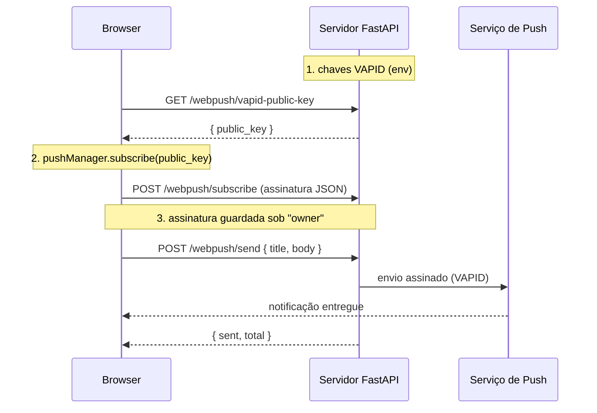

# WebPush ponta a ponta — do servidor ao browser 🔔

O exemplo [PWA install + WebPush](pwa-webpush.md) cobriu o lado do **browser**:
pedir permissão e criar a assinatura push. Mas uma assinatura sozinha não faz
nada — alguém precisa **enviar** a notificação. Esse alguém é o **seu servidor**,
com uma chave **VAPID** que prova ao serviço de push do navegador que o envio é
legítimo.

Esta página fecha o ciclo: você gera as chaves, monta um roteador FastAPI pronto,
o browser assina contra a sua chave pública, e o servidor dispara a notificação.
Tudo com as peças de `tempestweb.server`.

---

## O que você vai construir

Um app FastAPI mínimo que:

1. **Gera** um par de chaves VAPID (uma vez) e as lê do ambiente.
2. **Monta** o `webpush_router` — ele já expõe os endpoints de assinatura e envio.
3. **Assina** o browser contra a chave pública e guarda a assinatura no servidor.
4. **Envia** uma notificação para todas as assinaturas armazenadas.



!!! info "Quem faz o quê"
    O **servidor** é dono das chaves VAPID, do armazenamento de assinaturas e do
    caminho de envio. O **browser** é dono do fluxo de assinatura (service worker
    + `PushManager`). O serviço de push (Google, Mozilla, Apple…) é o
    intermediário que efetivamente entrega a mensagem ao dispositivo.

---

## Pré-requisitos

O WebPush do servidor depende do extra `[webpush]` (traz `cryptography` para as
chaves e `pywebpush` para o envio):

```bash
pip install "tempestweb[webpush]"
```

---

## Passo 1 — Gere as chaves VAPID 🔑

VAPID (*Voluntary Application Server Identification*) é um par de chaves P-256. A
**pública** vai para o browser; a **privada** assina cada envio e fica só no
servidor. Gere um par com o CLI:

```bash
tempestweb vapid
```

```
public_key:  BEl62iUYgUiv...kr3qBUYIHBQFLXYp5Nksh8U
private_key: 3Kw...redacted...s0

Keep the private key secret (export as VAPID_PRIVATE_KEY); share the public key with the browser client.
```

Para gerar linhas prontas para exportar como variáveis de ambiente, use `--env`:

```bash
tempestweb vapid --env
```

```
VAPID_PUBLIC_KEY=BEl62iUYgUiv...kr3qBUYIHBQFLXYp5Nksh8U
VAPID_PRIVATE_KEY=3Kw...redacted...s0
```

Você pode carregá-las direto no shell:

```bash
eval "$(tempestweb vapid --env)"
```

!!! warning "A chave privada é um segredo ⚠️"
    Nunca commite a chave privada. Trate-a como qualquer credencial: passe-a por
    variável de ambiente (`VAPID_PRIVATE_KEY`), secret manager ou `.env` fora do
    versionamento. Quem tiver essa chave pode enviar push em nome do seu app.

??? note "Gerando as chaves em código"
    O CLI é um atalho sobre `generate_vapid_keys()`. Você pode chamá-la
    diretamente — por exemplo, num script de setup:

    ```python
    from tempestweb.server import generate_vapid_keys

    keys = generate_vapid_keys()
    print(keys.public_key)   # base64url, sem padding
    print(keys.private_key)  # base64url, sem padding — mantenha em segredo
    ```

    `VapidKeys` tem só dois campos: `.public_key` e `.private_key`.

---

## Passo 2 — Monte o `webpush_router` 🚏

`webpush_router(service)` devolve um `APIRouter` pronto. Você o inclui no seu app
FastAPI e ganha quatro endpoints JSON de graça:

| Método | Rota | Corpo | Resposta |
|---|---|---|---|
| `GET` | `/webpush/vapid-public-key` | — | `{"public_key": ...}` |
| `POST` | `/webpush/subscribe` | assinatura do browser | `{"ok": true}` |
| `POST` | `/webpush/unsubscribe` | `{"endpoint": ...}` | `{"removed": true}` |
| `POST` | `/webpush/send` | payload (`{"title","body"}`) | `{"sent": N, "total": M}` |

Aqui está o app completo — copie e rode:

```python
from __future__ import annotations

from fastapi import FastAPI

from tempestweb.server import (
    InMemorySubscriptionStore,
    VapidConfig,
    WebPushService,
    generate_vapid_keys,
    webpush_router,
)


def _vapid() -> VapidConfig:
    """Resolve a config VAPID do ambiente, ou gera um par efêmero de dev."""
    config = VapidConfig.from_env()  # lê VAPID_PUBLIC_KEY / _PRIVATE_KEY / _SUBJECT
    if config.enabled:
        return config
    keys = generate_vapid_keys()
    return VapidConfig(public_key=keys.public_key, private_key=keys.private_key)


VAPID = _vapid()
SERVICE = WebPushService(VAPID, store=InMemorySubscriptionStore())

app = FastAPI(title="meu app com webpush")
app.include_router(webpush_router(SERVICE))
```

Explicando peça por peça:

- `VapidConfig.from_env()` lê `VAPID_PUBLIC_KEY`, `VAPID_PRIVATE_KEY` e
  `VAPID_SUBJECT` do ambiente. Se você exportou as chaves no Passo 1, é aqui que
  elas entram.
- `WebPushService(vapid, store=...)` amarra a config VAPID a um armazenamento de
  assinaturas. O `InMemorySubscriptionStore` cobre dev e testes; em produção você
  fornece o seu (SQLAlchemy, Redis…) implementando o protocolo `SubscriptionStore`.
- `webpush_router(SERVICE)` cria o roteador e `include_router` o pluga no app.

!!! tip "Chave privada vazia desliga o envio 💡"
    Se `VAPID_PRIVATE_KEY` estiver vazia, `VapidConfig.enabled` é `False` e cada
    `send` vira um no-op que reporta `ok=False` (nenhuma dependência de rede é
    tocada). É o mesmo padrão do "secret vazio desativa auth" do framework — ótimo
    para rodar em dev sem configurar nada. No exemplo acima, geramos um par
    **efêmero** nesse caso, então as assinaturas simplesmente resetam a cada
    restart.

!!! info "Um `owner` fixo mantém o roteador simples"
    O roteador arquiva toda assinatura sob um único `owner` (padrão `"default"`),
    então ele é *multi-tenant-free* por design. Um app com usuários reais escreve
    suas próprias rotas em volta do **mesmo** `WebPushService`, resolvendo o
    `owner` a partir da autenticação. Os blocos são reutilizáveis; só a política de
    "de quem é esta assinatura" muda.

---

## Passo 3 — O browser assina e envia a assinatura 📮

No browser, o fluxo é: registrar um service worker, pedir permissão, buscar a
chave pública do servidor, chamar `pushManager.subscribe(...)` e fazer `POST` da
assinatura resultante para `/webpush/subscribe`.

```javascript
const reg = await navigator.serviceWorker.register("/sw.js", { type: "classic" });
await navigator.serviceWorker.ready;

const perm = await Notification.requestPermission();
if (perm !== "granted") throw new Error("permission: " + perm);

// 1. pega a chave pública do servidor
const { public_key } = await (await fetch("/webpush/vapid-public-key")).json();

// 2. assina contra ela (b64ToU8 converte a chave base64url para Uint8Array)
const sub = await reg.pushManager.subscribe({
  userVisibleOnly: true,
  applicationServerKey: b64ToU8(public_key),
});

// 3. envia a assinatura para o servidor guardar
await fetch("/webpush/subscribe", {
  method: "POST",
  headers: { "content-type": "application/json" },
  body: JSON.stringify(sub.toJSON()),
});
```

!!! tip "Do lado Python, use o módulo nativo"
    Num app tempestweb você não escreve esse JS à mão. O
    [guia de transpile](../transpile.md) mostra
    `native.notifications.subscribe(vapid_public_key)` — devolve exatamente o JSON
    de assinatura que você faz `POST` para `/webpush/subscribe` — e
    `native.notifications.push_state()`, que reporta `{supported, permission}` sem
    disparar o prompt. O bloco JS acima é o que roda por baixo.

---

## Passo 4 — O servidor dispara a notificação 🚀

Com pelo menos uma assinatura guardada, um `POST` para `/webpush/send` empurra o
payload para **todas** as assinaturas do `owner`:

```bash
curl -X POST http://127.0.0.1:8000/webpush/send \
  -H "content-type: application/json" \
  -d '{"title": "Olá", "body": "do tempestweb"}'
```

```json
{"sent": 1, "total": 1}
```

`sent` é quantas foram aceitas pelo serviço de push; `total` é quantas assinaturas
o `owner` tinha. Assinaturas mortas (o serviço de push responde `410 Gone`) são
podadas automaticamente do armazenamento no envio.

??? note "Enviando de dentro do seu código"
    O roteador é uma casca fina sobre o `WebPushService`. De qualquer lugar do seu
    app — uma task de fundo, um handler de evento — você chama o serviço direto:

    ```python
    outcomes = SERVICE.send_to_owner("default", {"title": "Olá", "body": "mundo"})
    for outcome in outcomes:
        print(outcome.endpoint, outcome.ok, outcome.status_code)
    ```

    `send_to_owner` devolve uma lista de `SendOutcome` (uma por assinatura, `[]`
    quando o owner não tem nenhuma). Há também `broadcast(payload)` para atingir
    **todas** as assinaturas guardadas, e `send(subscription, payload)` para uma só.

---

## O exemplo completo, rodando ▶

Um app pronto vive em `examples/webpush-server/server.py`: ele resolve o VAPID do
ambiente (caindo num par efêmero de dev), monta o `webpush_router` e serve uma
página de demonstração com um service worker de push mínimo.

```bash
# opcional: fixe um par para as assinaturas sobreviverem a restarts
eval "$(tempestweb vapid --env)"

uv run uvicorn server:app --app-dir examples/webpush-server --reload
```

Abra <http://127.0.0.1:8000>, clique em **Enable notifications** (conceda a
permissão) e depois em **Send test** — uma notificação do sistema aparece,
entregue pelo serviço de push do browser a partir do envio assinado do servidor.

!!! warning "A entrega real precisa de HTTPS + permissão + (no iOS) app instalado"
    A entrega de push de verdade **não** funciona em qualquer contexto:

    - A página precisa ser servida por **HTTPS** (ou `localhost` em dev).
    - O usuário precisa ter **concedido** a permissão de notificação.
    - No **iOS (16.4+)**, o WebPush **só funciona com o PWA instalado** na tela
      inicial — veja o [exemplo de PWA install](pwa-webpush.md) para gerar o
      manifest instalável.

---

## O que dá — e o que não dá — para automatizar ✅

Seja honesto sobre o que os testes cobrem:

- ✅ **O caminho do servidor é testado por unidade.** Geração de chaves, o
  roteador (assinatura/remoção/envio) e o `WebPushService` (com um sender
  injetado) têm testes verdes — sem tocar a rede.
- ⚠️ **A assinatura e a permissão do browser + a entrega real do push** dependem
  de dispositivo, de um gesto do usuário e de um serviço de push externo. Isso
  **não é automatizável em CI** e precisa de verificação manual num browser real.

!!! danger "Sem promessas falsas"
    Este exemplo **não** afirma entrega ponta a ponta automatizada. O servidor
    assina e despacha o pedido; a partir daí, o serviço de push e o dispositivo é
    que decidem se e quando a notificação aparece.

---

## Recapitulando

Neste guia você:

- ✅ Gerou um par de chaves VAPID com `tempestweb vapid --env` (e viu
  `generate_vapid_keys()` por baixo).
- ✅ Montou o `webpush_router` num app FastAPI com `app.include_router(...)`.
- ✅ Aprendeu os quatro endpoints: `vapid-public-key`, `subscribe`, `unsubscribe`
  e `send`.
- ✅ Assinou o browser contra a chave pública e enviou a assinatura para o
  servidor guardar.
- ✅ Disparou uma notificação com `POST /webpush/send` (e viu `send_to_owner` /
  `broadcast` no serviço).
- ✅ Entendeu que a chave privada é um segredo, que uma chave vazia desativa o
  envio, e que a entrega real precisa de HTTPS + permissão + (iOS) app instalado.

---

## Próximos passos

- 💡 Volte ao [PWA install + WebPush](pwa-webpush.md) para o lado do consentimento
  no browser (permissão + `subscribe`) escrito em Python puro.
- 💡 Troque o `InMemorySubscriptionStore` por uma implementação persistente de
  `SubscriptionStore` (SQLAlchemy, Redis) e resolva o `owner` a partir da sua
  autenticação.
- 💡 Leia a [documentação PWA](../pwa.md) (Trilho P) para o service worker (P1) e o
  modo offline-first (P2).
